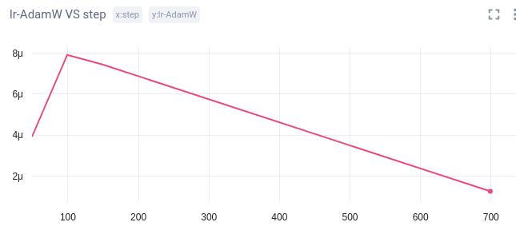
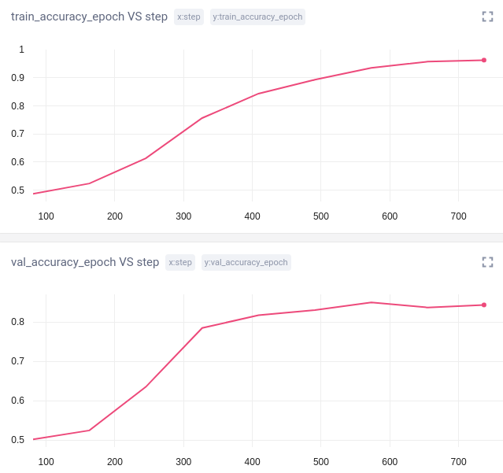
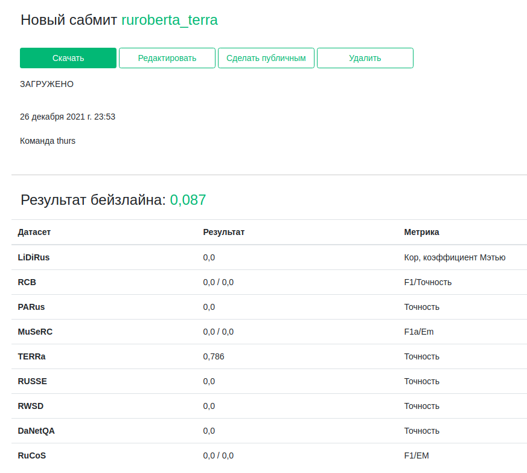
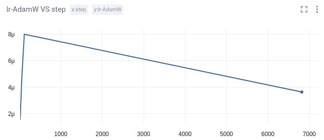
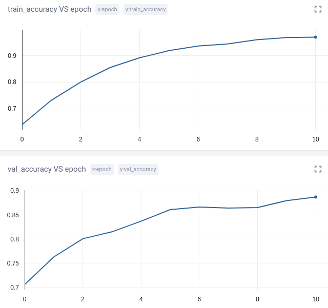
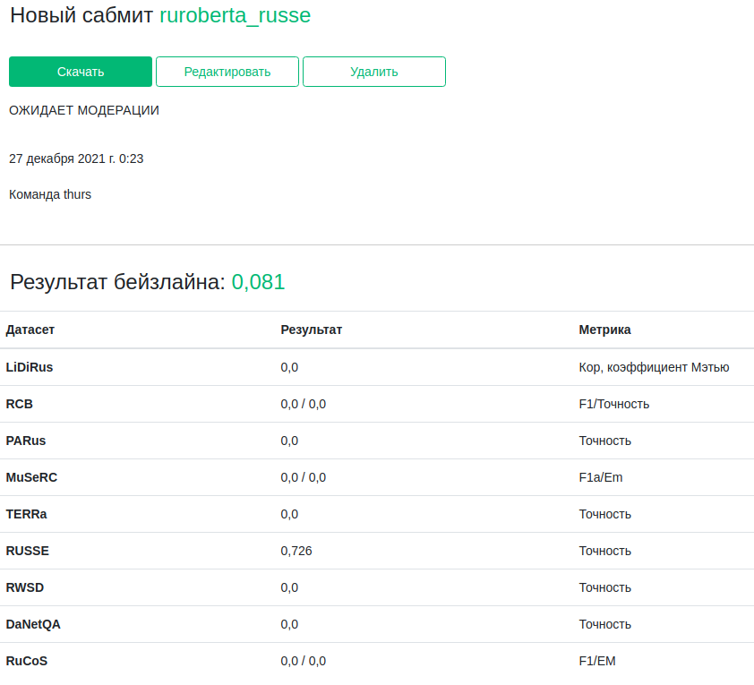

<div align="center">

# Russian SuperGLUE test task


[](https://github.com/Thurs88/russian_superglue_task#requirements)
[](https://github.com/Thurs88/russian_superglue_task/blob/master/.pre-commit-config.yaml)
[](https://github.com/psf/black)

</div>

PyTorch Lightning pipeline for test task based on [RussianSuperGLUE benchmark](https://russiansuperglue.com).  

Main frameworks used: 
* [hydra](https://github.com/facebookresearch/hydra)
* [pytorch-lightning](https://github.com/PyTorchLightning/pytorch-lightning)

Used models:  
[ruRoberta-large](https://huggingface.co/sberbank-ai/ruRoberta-large)

Used datasets:  
* [TERRa](https://russiansuperglue.com/tasks/task_info/TERRa)
* [RUSSE](https://russiansuperglue.com/tasks/task_info/RUSSE)


## Description

* bin/ - executable files
    * ruroberta_train.py - main train loop
    * ruroberta_validation.py - model estimation on the val dataset
    * ruroberta_test.py - model inference on the test dataset
    * ruroberta_inference.py - model inference on individual examples
* cfg - configs with experiment settings
    * augmentation
    * callbacks
    * datamodule
    * inference
    * logging
    * loss
    * metric
    * model
    * optimizer
    * private
    * scheduler
    * trainer
    * training
* data - datasets
* notebooks - jupyter-notebooks
* outputs - results of experiments
* pipeline - main pipeline code
    * callbacks - various callbacks
    * datamodules - LightningDataModule classes
    * datasets - PyTorch dataset classes
    * losses - custom losses
    * metrics - custom metrics
    * models - PyTorch model classes
    * schedulers - lr schedulers
    * wrappers - pytorch-lightning model wrappers
* src - various utilities and support functions
* requirements.txt


## Results
1) ruRoberta-large fine-tuned on TERRa dataset  
best model train/val/test accuracy: 0.935/0.850/0.786
* lr schedule
  
* train/val accuracy
  
* Submission  
  

2) ruRoberta-large fine-tuned on RUSSE dataset  
best model train/val/test accuracy: 0.969/0.886/0.726
* lr schedule  
  
* train/val accuracy  
  
* Submission  
  

## Further
* make multi-task learning
* try to fine-tune ruT5-large
* use Label Smoothing Loss

## How to run
First, install dependencies
```bash
# clone project
git clone https://github.com/Thurs88/russian_superglue_task

# install project
cd russian_superglue_task
pip install pre-commit
pip install -r requirements.txt
pre-commit install
 ```
Next, navigate to any file and run it.  

* train models  
For example, this command will run training on TERRa dataset:
```shell
>>> python bin/ruroberta_train.py --config-name='ruroberta_terra_config'
```

* validate models
```shell
>>> python bin/ruroberta_terra_validation.py
```

* test models and make submission
```shell
>>> python bin/ruroberta_terra_test.py
```

* inference
```shell
>>> python bin/ruroberta_inference.py --task_name=terra
```
Example:  
```
Введите sentence1: Гвардейцы подошли к грузовику, который как оказалось, попросту сломался.
Введите sentence2: Гвардейцы подошли к сломанному грузовику.
Predicted label: entailment
```